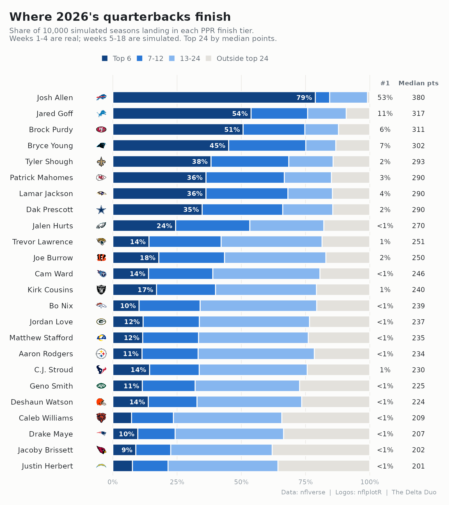
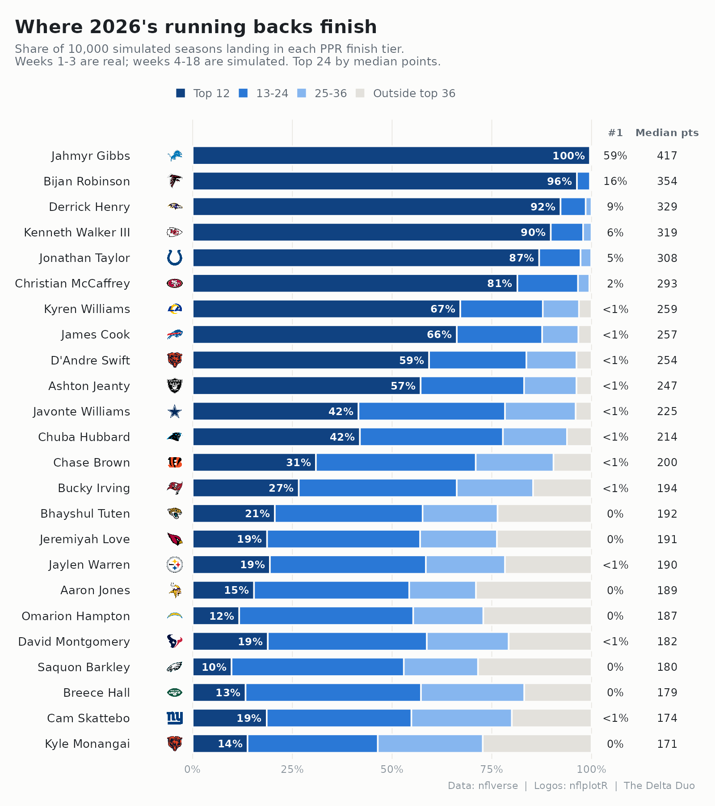
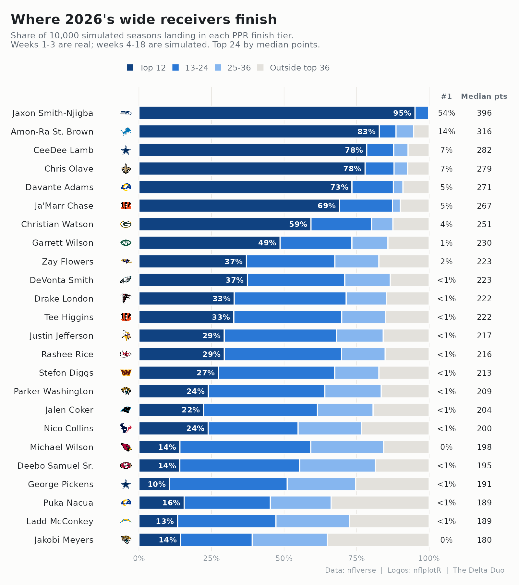
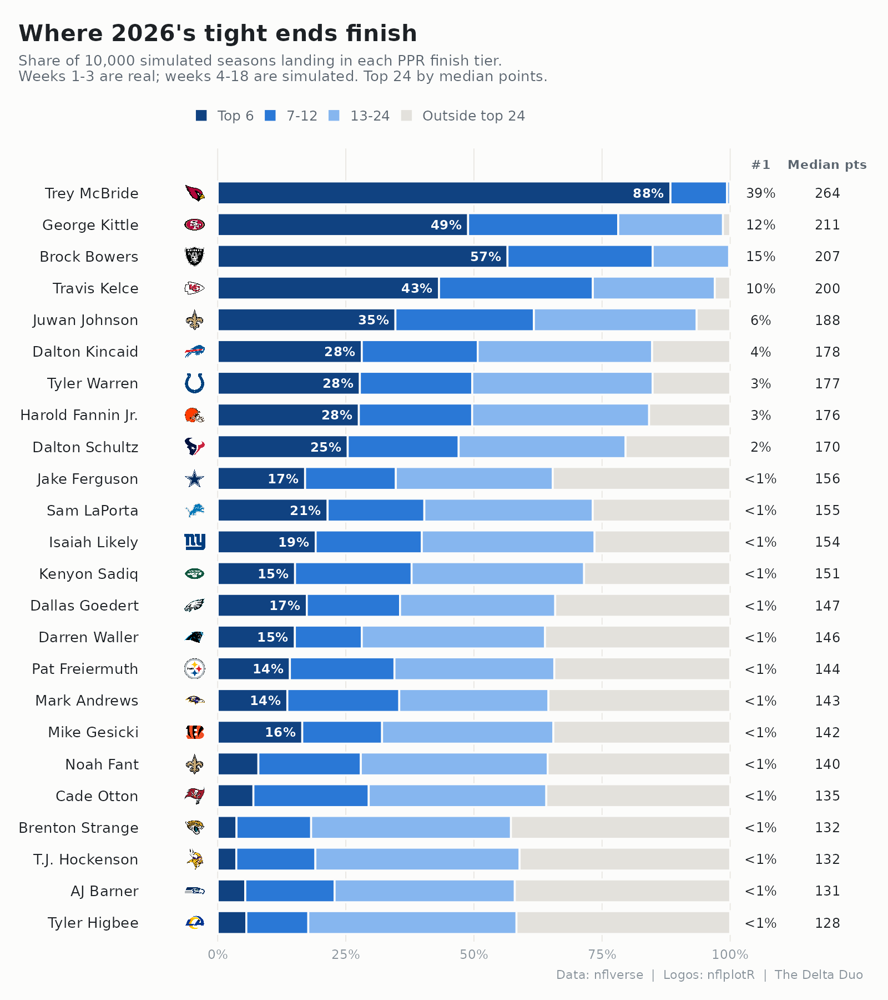

# 2026 season simulation: fantasy finish odds

nflseedr simulates the rest of a season game by game to get playoff odds. This does
the same thing for **fantasy finishes**: it takes 2026 as it stands after week 3,
simulates the remaining 15 weeks 10,000 times, and counts how often each player
finishes #1, top 12, top 24, etc. at his position (full PPR, regular season).

Results for every player: `sim_2026.csv`. Charts (made with nflplotR):






## Running it

```sh
./fetch.sh                                   # nflverse schedule + weekly player stats, 2020-2026
python3 fit.py 3 2025                        # fit on 2022-2025 at week 3   -> params_2025.json
python3 sim.py 2026 params_2025.json 10000   # simulate 2026               -> sim_2026.csv
Rscript plot.R 2026                          # charts                      -> plots/*.png

# out-of-sample checks
python3 fit.py 3 2024 && python3 calibrate.py 2025 params_2024.json
python3 fit.py 3 2023 && python3 calibrate.py 2024 params_2023.json
```

The simulation is Python standard library only. The charts need R with `ggplot2` and
`nflplotR` (`install.packages("nflplotR")`); team logos ship inside nflplotR. 10,000 seasons run in about 6 seconds. To update after week 4,
rerun `fetch.sh`, then `fit.py 4 2025`, `sim.py` and `plot.R`.

## Method

1. **Pool.** Every QB, RB, WR and TE who recorded a stat in weeks 1–3. Team is his
   team in his latest game; team games left come from the 2026 schedule (byes handled).
2. **Expected points per remaining team game.** A linear regression per position,
   fit on 2022–2025 at the same point in the season (after week 3). Inputs: PPR
   points per game so far, share of games played so far, last season's points per game
   and games played, and two seasons ago's points per game. The target counts missed
   games as zero, so injury risk is built in. It beats "keep scoring at this pace":

   | | QB | RB | WR | TE |
   |---|--:|--:|--:|--:|
   | Model error (pts/game, RMSE) | 5.3 | 3.6 | 3.3 | 2.5 |
   | "Same pace" error | 7.2 | 4.7 | 4.7 | 3.3 |

   Rough weights: each point of this season's pace is worth about 0.2–0.4 points of
   expectation and each point of last season's about 0.2–0.3 (QB: under 0.1, where
   being a full-time starter last year matters more than how well he scored). The
   rest is pulled toward the position average. Three weeks is not much signal.
3. **Uncertainty.** Each simulated season, each player gets his expected rate plus an
   error drawn from the 40 backtest players whose expectation was closest to his
   (how far off they actually came in). That one draw covers injury, role change and
   simply playing better or worse. Points already scored are kept.
4. **Finish.** Rank season totals within position in every simulation and count.

## Does it work?

Simulate a finished season from week 3 using a fit that never saw that season, then
check the odds against what happened. "Skill" is improvement over guessing the base
rate (0 = no better, 1 = perfect).

| Season tested | QB top 12 | RB top 24 | WR top 24 | TE top 12 |
|---|--:|--:|--:|--:|
| 2025 (fit on 2022–24) | +0.46 | +0.40 | +0.35 | +0.37 |
| 2024 (fit on 2022–23) | +0.37 | +0.53 | +0.20 | +0.37 |

Calibration is reasonable for the sample size: in 2025, RB-top-24 calls of 30–50%
came in 44% of the time, WR-top-36 calls of 70–90% came in 74%. WR top 12 is the
weakest call (skill +0.09 in 2024). Full bins: `python3 calibrate.py`.

Only 2 of 240 actual top-24/top-36 finishers in the two test seasons were missing from the
week-1–3 pool, so leaving out not-yet-active players costs little.

## Known injuries: `overrides.csv`

General injury risk is already built in (the backtest counts missed games as zero).
A specific injury is not, so enter it by hand: `player,team,out_min,out_max,note`.
Each simulated season draws a whole number of missed games between `out_min` and
`out_max` (inclusive, equally likely) and those games score zero. Names must match
nflverse exactly; `sim.py` warns if one doesn't. Remove the row once he's back. For a season-ending injury set both to his team's games left.

Currently:

| Player | Out | Median finish | Top 24 |
|---|---|--:|--:|
| Breece Hall (NYJ) | 1-3 games (quad, week 3; did not practice week 4) | RB19 -> RB23 | 66% -> 55% |
| Travis Etienne (NO) | 1-3 games | RB23 -> RB28 | 53% -> 38% |
| De'Von Achane (MIA) | rest of season (14 games) | RB24 -> RB81 | 52% -> 0% |

## Caveats

- **Little news.** Beyond `overrides.csv`, the model sees box scores only. It does
  not know about depth-chart changes, trades, or a player returning from IR. Anyone
  who has not played yet in 2026 is not in the pool.
- **Players are independent.** If a WR1 gets hurt, his teammates do not get a bump in
  the same simulation, and there is no team-level boom or bust shared by teammates.
  nflseedr's game-by-game structure would add that; this version does not.
- **Rookies** get only their 2026 games plus the position average, so they are
  pulled hard toward the middle.
- Two backtest seasons is a small check. Treat odds near 50% as coin flips with lean.

## 2026 after week 3: top 15 at each position

**QB**

| Player | Tm | Pts wk 1–3 | Median total (10th–90th) | Median finish | #1 | Top 6 | Top 12 | Top 24 |
|---|---|--:|--:|--:|--:|--:|--:|--:|
| Josh Allen | BUF | 93.9 | 386 (238–463) | 2 | 49% | 77% | 85% | 99% |
| Brock Purdy | SF | 80.9 | 303 (193–395) | 7 | 9% | 44% | 76% | 92% |
| Jared Goff | DET | 65.6 | 303 (143–380) | 7 | 8% | 45% | 70% | 88% |
| Bryce Young | CAR | 69.2 | 293 (182–384) | 9 | 6% | 36% | 69% | 91% |
| Patrick Mahomes | KC | 66.6 | 292 (133–370) | 9 | 5% | 35% | 66% | 89% |
| Dak Prescott | DAL | 63.1 | 288 (129–366) | 10 | 4% | 33% | 65% | 89% |
| Lamar Jackson | BAL | 60.2 | 284 (179–366) | 10 | 4% | 31% | 62% | 89% |
| Tyler Shough | NO | 69.4 | 284 (159–362) | 10 | 2% | 28% | 60% | 88% |
| Jalen Hurts | PHI | 53.5 | 280 (119–371) | 11 | 3% | 28% | 58% | 87% |
| Trevor Lawrence | JAX | 52.0 | 266 (136–344) | 13 | 1% | 21% | 48% | 85% |
| Matthew Stafford | LA | 52.0 | 264 (135–358) | 13 | 2% | 21% | 47% | 85% |
| Bo Nix | DEN | 43.7 | 256 (126–349) | 15 | 1% | 18% | 40% | 82% |
| Jordan Love | GB | 51.8 | 246 (127–358) | 16 | 1% | 18% | 38% | 78% |
| Geno Smith | NYJ | 50.9 | 237 (127–353) | 17 | 1% | 16% | 35% | 76% |
| Cam Ward | TEN | 41.2 | 234 (121–337) | 17 | 1% | 15% | 31% | 75% |

**RB**

| Player | Tm | Pts wk 1–3 | Median total (10th–90th) | Median finish | #1 | Top 12 | Top 24 | Top 36 |
|---|---|--:|--:|--:|--:|--:|--:|--:|
| Jahmyr Gibbs | DET | 98.3 | 417 (331–495) | 1 | 59% | 100% | 100% | 100% |
| Bijan Robinson | ATL | 77.7 | 354 (264–435) | 3 | 16% | 96% | 100% | 100% |
| Derrick Henry | BAL | 74.9 | 329 (239–411) | 4 | 9% | 92% | 99% | 100% |
| Kenneth Walker III | KC | 79.2 | 319 (236–400) | 5 | 6% | 90% | 98% | 100% |
| Jonathan Taylor | IND | 63.5 | 308 (217–389) | 5 | 5% | 87% | 97% | 100% |
| Christian McCaffrey | SF | 58.0 | 293 (208–373) | 6 | 2% | 81% | 97% | 99% |
| James Cook | BUF | 50.2 | 257 (150–339) | 9 | 1% | 66% | 88% | 97% |
| Kyren Williams | LA | 53.0 | 259 (144–323) | 9 | 0% | 67% | 88% | 97% |
| D'Andre Swift | CHI | 56.1 | 254 (140–319) | 11 | 1% | 59% | 84% | 96% |
| Ashton Jeanty | LV | 55.3 | 247 (138–297) | 11 | <1% | 57% | 83% | 96% |
| Javonte Williams | DAL | 50.5 | 225 (145–278) | 14 | <1% | 42% | 78% | 96% |
| Chuba Hubbard | CAR | 53.1 | 214 (132–279) | 14 | <1% | 42% | 78% | 94% |
| Chase Brown | CIN | 38.9 | 200 (111–264) | 17 | <1% | 31% | 71% | 90% |
| Bucky Irving | TB | 41.1 | 194 (91–279) | 19 | <1% | 27% | 66% | 85% |
| Bhayshul Tuten | JAX | 41.0 | 192 (84–266) | 21 | <1% | 21% | 58% | 76% |

**WR**

| Player | Tm | Pts wk 1–3 | Median total (10th–90th) | Median finish | #1 | Top 12 | Top 24 | Top 36 |
|---|---|--:|--:|--:|--:|--:|--:|--:|
| Jaxon Smith-Njigba | SEA | 104.1 | 396 (267–489) | 1 | 54% | 95% | 100% | 100% |
| Amon-Ra St. Brown | DET | 75.8 | 316 (188–426) | 3 | 14% | 83% | 89% | 95% |
| CeeDee Lamb | DAL | 70.9 | 282 (169–392) | 5 | 7% | 78% | 88% | 93% |
| Chris Olave | NO | 70.5 | 279 (165–389) | 5 | 7% | 78% | 88% | 93% |
| Davante Adams | LA | 65.8 | 271 (156–364) | 6 | 5% | 73% | 88% | 91% |
| Ja'Marr Chase | CIN | 54.5 | 267 (152–377) | 7 | 5% | 69% | 87% | 90% |
| Christian Watson | GB | 69.4 | 251 (136–344) | 9 | 4% | 59% | 80% | 88% |
| Garrett Wilson | NYJ | 57.3 | 230 (116–322) | 13 | 1% | 49% | 73% | 86% |
| DeVonta Smith | PHI | 48.5 | 223 (149–255) | 15 | <1% | 37% | 71% | 87% |
| Zay Flowers | BAL | 41.4 | 223 (110–316) | 16 | 2% | 37% | 68% | 83% |
| Drake London | ATL | 42.8 | 222 (124–281) | 16 | <1% | 33% | 71% | 85% |
| Tee Higgins | CIN | 44.4 | 222 (124–255) | 17 | <1% | 33% | 70% | 85% |
| Rashee Rice | KC | 38.0 | 216 (138–250) | 17 | <1% | 29% | 70% | 85% |
| Justin Jefferson | MIN | 44.9 | 217 (119–250) | 18 | <1% | 29% | 68% | 84% |
| Stefon Diggs | WAS | 44.5 | 213 (95–246) | 18 | <1% | 27% | 67% | 83% |

**TE**

| Player | Tm | Pts wk 1–3 | Median total (10th–90th) | Median finish | #1 | Top 6 | Top 12 | Top 24 |
|---|---|--:|--:|--:|--:|--:|--:|--:|
| Trey McBride | ARI | 59.1 | 264 (199–342) | 2 | 39% | 88% | 99% | 100% |
| Brock Bowers | LV | 27.6 | 207 (166–304) | 6 | 16% | 56% | 85% | 100% |
| George Kittle | SF | 47.4 | 197 (156–294) | 7 | 12% | 49% | 79% | 99% |
| Travis Kelce | KC | 49.1 | 207 (146–284) | 8 | 10% | 44% | 73% | 97% |
| Juwan Johnson | NO | 48.3 | 188 (134–266) | 10 | 6% | 35% | 62% | 93% |
| Dalton Kincaid | BUF | 44.3 | 171 (116–254) | 12 | 4% | 28% | 51% | 85% |
| Tyler Warren | IND | 39.4 | 177 (115–253) | 13 | 3% | 27% | 50% | 84% |
| Harold Fannin Jr. | CLE | 38.6 | 169 (114–252) | 13 | 3% | 27% | 48% | 84% |
| Dalton Schultz | HOU | 39.5 | 163 (109–246) | 14 | 2% | 25% | 46% | 79% |
| Sam LaPorta | DET | 34.4 | 162 (100–233) | 16 | 1% | 21% | 41% | 73% |
| Isaiah Likely | NYG | 39.4 | 153 (93–227) | 16 | 1% | 19% | 39% | 73% |
| Kenyon Sadiq | NYJ | 38.6 | 151 (89–223) | 16 | <1% | 15% | 37% | 71% |
| Dallas Goedert | PHI | 25.1 | 154 (93–230) | 18 | 1% | 18% | 35% | 67% |
| Jake Ferguson | DAL | 32.2 | 135 (94–227) | 18 | 1% | 17% | 34% | 65% |
| Mike Gesicki | CIN | 31.5 | 142 (85–224) | 19 | 1% | 17% | 32% | 65% |
