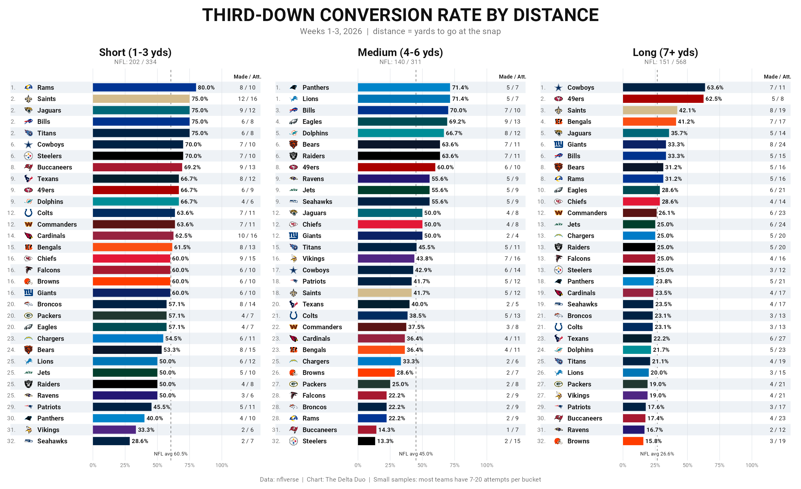

# Third-down conversion rate by distance

Off a post ranking every team's third-down conversion rate, weeks 1-3, 2026.
Same numbers, split by yards to go at the snap:

- **Short**: 1-3 yards (NFL 60.5%, 202 / 334)
- **Medium**: 4-6 yards (NFL 45.0%, 140 / 311)
- **Long**: 7+ yards (NFL 26.6%, 151 / 568)

A play counts when nflverse marks it `third_down_converted` or
`third_down_failed`. That rule reproduces the post's made / att for all 32 teams.



## What it shows

- **49ers** (#1 overall) get there by being good everywhere, and by rarely
  facing long: only 8 of their 27 attempts were 7+, and they made 5.
- **Cowboys** are the best long-yardage team (7 / 11). They are ordinary on
  medium (42.9%).
- **Saints** are top 3 in short and long, which is how they reach 53.2% on
  the most attempts in the league (47).
- **Packers** (#32 overall) are slightly below average on short and bottom 6 on medium and long.
- **Steelers** split hard: 70% on short, last on medium (2 / 15).

Most teams have 7-20 attempts per bucket, so one conversion moves a rate
5-15 points. Read this as "what has happened," not "who is good."

## Run it

```bash
Rscript third_down_distance.R            # 2026, weeks 1-3
Rscript third_down_distance.R 2026 4     # through week 4
```

Needs R packages `nflreadr`, `nflplotR`, `dplyr`, `ggplot2`, `patchwork`,
`ragg`, `systemfonts`. Writes `third_down_distance.png` and
`third_down_distance.csv` (gitignored) next to the script. Team logos come
from the logo data bundled inside nflplotR.
