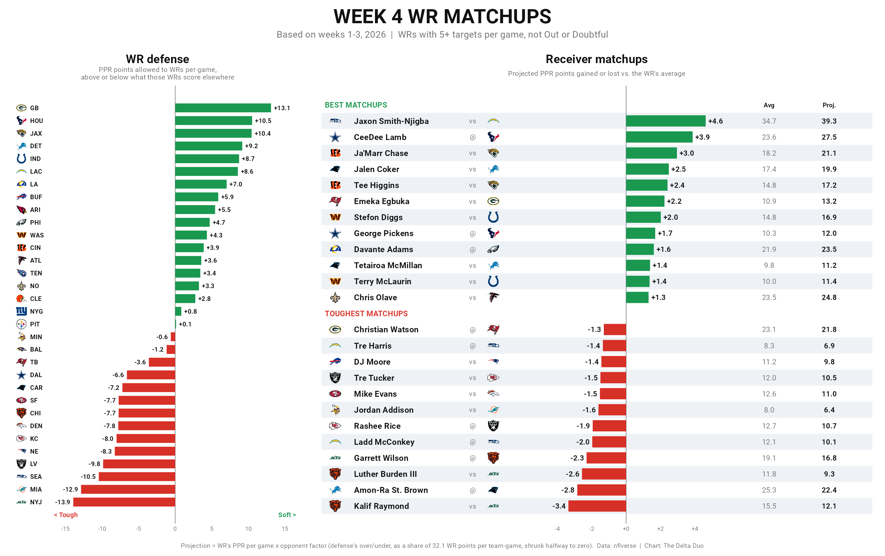

# Week 4 WR matchups

Best and worst wide receiver matchups for week 4, 2026, from weeks 1-3 data.



## How it works

- **Offense:** each WR's PPR points per game so far is his baseline.
- **Defense:** for every WR who faced a defense, compare what he scored against
  it with his average in his other games. Sum those gaps per game. A defense
  that holds receivers below their norms is tough; one that lets them beat
  their norms is soft. This adjusts for who each defense has faced.
- **Projection:** baseline x (1 + half of that gap / league WR points per
  team-game, 32.1). Halved because three games is little data.
- **Edge:** projection minus baseline, in PPR points.

Pool: WRs with 2+ games and 5+ targets per game, not listed Out or Doubtful
on the week 4 injury report. PIT at CLE was already played Thursday, so
those receivers are left out (their defenses still count).

## Caveats

- Three games per defense. One big game moves a defense a lot.
- No adjustment for slot vs. outside, shadow corners, or weather.

## Run it

```bash
Rscript wr_matchups.R            # 2026, week 4
Rscript wr_matchups.R 2026 5     # week 5, using weeks 1-4
```

Writes `wr_matchups.png` and `wr_matchups.csv` (gitignored) next to the script.
